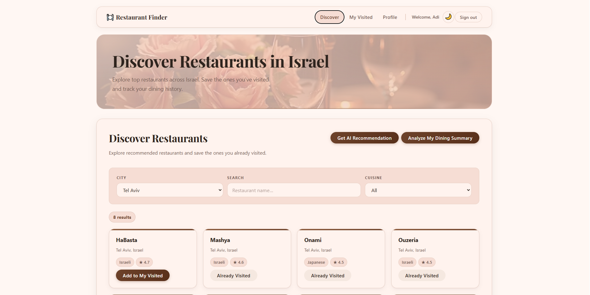
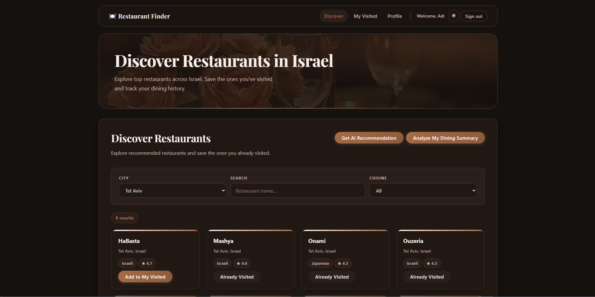
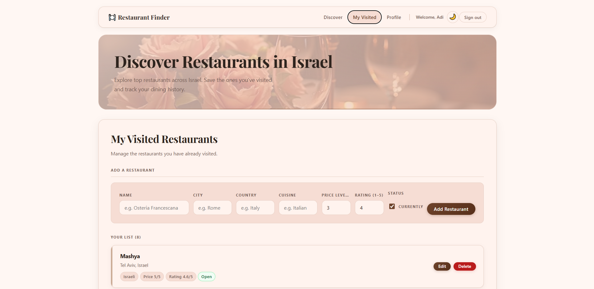
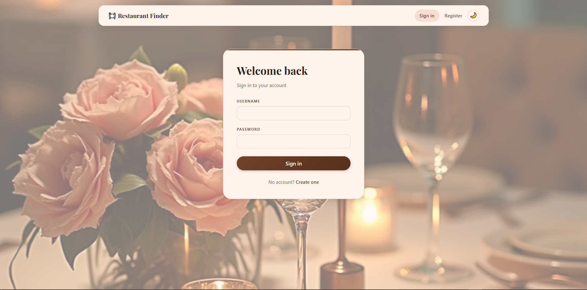
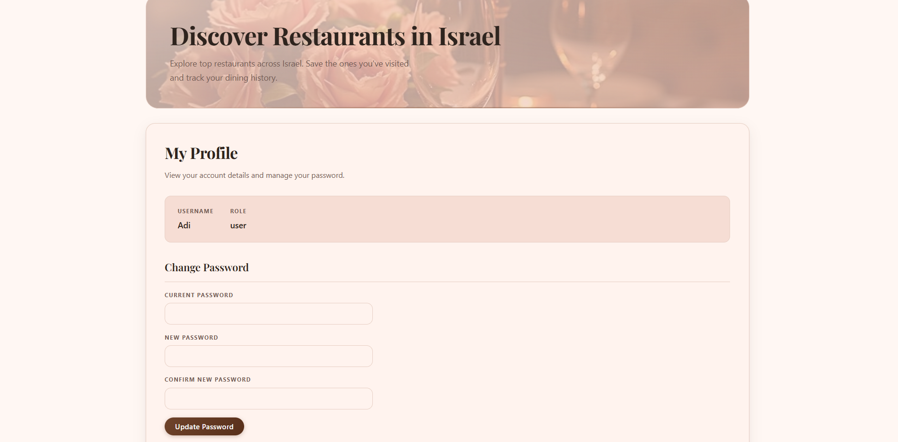

# Restaurant Finder

## Description

Restaurant Finder is a full-stack web application for discovering restaurants across Israel, managing a personal visited list, and receiving AI-powered restaurant recommendations.

The project is built with a **FastAPI** backend, a **React** frontend, **SQLite** for persistence, **Redis** for caching and job queuing, an **Arq** background worker for dining-summary jobs, and a dedicated **AI microservice** for constrained restaurant recommendations.

## Why this project is interesting

Restaurant Finder combines several ideas into one polished product:

* a multi-service architecture with backend, worker, Redis, frontend, and AI service
* a shared Israeli restaurant discovery catalogue
* per-user restaurant management
* background dining-summary jobs
* constrained AI recommendations that work only from the app’s catalogue

The result is not just a CRUD application, but a complete product flow with authentication, async processing, AI integration, and a refined user interface.

---

## EX3 Scope

This submission covers the full EX3 feature set and its final product refinements:

* **Authentication**: JWT-based user accounts (register, login, me, admin)
* **Per-user restaurants**: all CRUD operations are scoped to the authenticated user
* **Background jobs**: Arq worker computes a personalized dining summary on demand
* **Refresh job API**: `POST /refresh-jobs` + `GET /refresh-jobs/{job_id}` with idempotency and ownership checks
* **Refresh script**: `scripts/refresh.py` — async Typer CLI with retries and tracing
* **AI recommendation service**: separate `ai_service` that recommends restaurants only from the Israeli discover catalogue
* **Discover catalogue**: backend-served Israeli restaurant catalogue with seeded data and optional OSM/Overpass ingestion
* **Frontend auth UI**: login, register, protected routes, logout
* **Frontend Discover UI**: city filter, search, cuisine filtering, add-to-visited, AI recommendation, dining summary
* **Theme support**: polished light/dark mode
* **Docker Compose**: Redis, backend, worker, frontend, and AI service orchestrated together

---

## Features

### Backend

* FastAPI REST API
* JWT authentication (HS256, `iss` / `aud` / `sub` / `role` / `exp` claims, 30-minute expiry)
* bcrypt password hashing via passlib
* role-based access control (`user` / `admin`)
* per-user restaurant CRUD with duplicate prevention scoped per user
* Redis rate limiting on `POST /token`
* Idempotency-Key support on `POST /refresh-jobs`
* refresh job ownership checks
* SQLite persistence via Python’s built-in `sqlite3`
* Discover catalogue API:

  * `GET /discover/cities`
  * `GET /discover/restaurants`
* AI recommendation API:

  * constrained to the Israeli discover catalogue
  * excludes already visited restaurants
  * excludes previously suggested restaurants when asking again

### Worker

* Arq background worker (`worker/main.py`)
* `refresh_restaurants_task` groups restaurants by cuisine, computes average rating, finds highest-rated, and returns a personalized dining summary
* writes job status (`pending` → `running` → `done` / `failed`) to Redis

### AI Service

* dedicated FastAPI microservice (`ai_service`)
* receives filtered Israeli candidate restaurants from the backend
* uses Gemini with constrained selection logic
* never recommends restaurants outside the provided candidate list
* excludes visited and previously suggested restaurants
* fallback logic also respects the same exclusions

### Discover Catalogue

* shared catalogue of Israeli restaurants stored in `discover_restaurants`
* seeded with curated Israeli restaurants for cold start
* optional ingestion from OpenStreetMap / Overpass via `scripts/ingest_discover.py`
* supports multiple cities from the start:

  * Tel Aviv
  * Jerusalem
  * Haifa
  * Ashdod

### Scripts

* `scripts/refresh.py`: async Typer CLI for triggering dining-summary jobs
* `scripts/ingest_discover.py`: Typer CLI for ingesting Israeli restaurant data into the discover catalogue

### Frontend

* React + Vite
* Login and Register pages with validation/error handling
* protected routes
* navbar with user greeting, theme toggle, and logout
* **Discover page**:

  * browse restaurants from the backend catalogue
  * filter by city
  * search by name
  * filter by cuisine
  * add restaurants to visited
  * request AI recommendation
  * ask again for a different recommendation
  * run **Analyze My Dining Summary**
* **My Visited page**:

  * create, edit, and delete personal restaurant entries
* **Profile page with password change flow**
* refined **light and dark mode**
* Sign In page with styled restaurant-image background

### Infrastructure

* Docker Compose with **five services**:

  * redis
  * backend
  * worker
  * frontend
  * ai_service
* Redis healthcheck (`redis-cli ping`)
* backend healthcheck (`curl /health`)
* AI service healthcheck (`curl /health`)
* `depends_on: condition: service_healthy` for startup order
* named Docker volumes for SQLite and Redis data

---

## Screenshots

The following screenshots present the main user flows and UI states of the application.

### Discover Page — Light Mode

*Shows the main discover experience, the Israeli restaurant catalogue, filters, and the main user actions.*



### Discover Page — Dark Mode

*Shows the dark theme variation of the main discover experience.*



### My Visited Page

*Shows the personal visited restaurants area, including add, edit, and delete actions.*



### Sign In Page

*Shows the authentication page with the restaurant-inspired background design.*



### Profile Page

*Shows the user profile area, including account details and the change-password functionality.*



---

## Quick Start

Run the full application with Docker Compose:

```bash
docker compose up --build
```

Then:

1. Open the frontend at `http://localhost:5173`
2. Register a new user
3. Browse restaurants by city on the Discover page
4. Add restaurants to your visited list
5. Test **AI Recommendation**
6. Test **Analyze My Dining Summary**

---

## Prerequisites

* Python 3.13
* [`uv`](https://docs.astral.sh/uv/)
* Node.js and npm
* Docker Desktop

---

## Run with Docker Compose

```bash
docker compose up --build
```

| Service    | URL                        |
| ---------- | -------------------------- |
| Frontend   | http://localhost:5173      |
| Backend    | http://localhost:8000      |
| API docs   | http://localhost:8000/docs |
| AI service | http://localhost:8001      |

---

## Demo Flow

A quick end-to-end demo path for the application:

1. Register or sign in
2. Browse restaurants by city
3. Add one or more restaurants to **My Visited**
4. Request an **AI Recommendation**
5. Click **Ask again** to receive a different recommendation
6. Run **Analyze My Dining Summary** to generate the personalized dining summary
7. Open **Profile** and test the password-change flow

---

Local demo helper:

```bash
bash scripts/demo.sh

## Run the Backend Locally

```bash
uv run uvicorn app.main:app --reload
```

Requires Redis on `localhost:6379` unless `REDIS_URL` is overridden.

---

## Run the Worker Locally

```bash
uv run arq worker.main.WorkerSettings
```

---

## Run the AI Service Locally

```bash
uv run uvicorn ai_service.main:app --reload --port 8001
```

---

## Run Backend Tests

```bash
uv run pytest -v
```

Current backend test suite: **122 tests, all passing**.

---

## Run the Frontend Locally

```bash
cd frontend
npm install
npm run dev
```

Frontend starts at `http://localhost:5173`.

---

## Run the Refresh Script

```bash
uv run python -m scripts.refresh --url http://localhost:8000 --token <your_token>
```

---

## Run the Discover Ingest Script

```bash
uv run python -m scripts.ingest_discover
```

Examples:

```bash
uv run python -m scripts.ingest_discover --city "Tel Aviv"
uv run python -m scripts.ingest_discover --city "Jerusalem" --city "Haifa"
```

---

## API Endpoints

| Method   | Path                    | Auth  | Description                                                    |
| -------- | ----------------------- | ----- | -------------------------------------------------------------- |
| `POST`   | `/auth/register`        | —     | Register a new user                                            |
| `POST`   | `/token`                | —     | Login and get JWT                                              |
| `GET`    | `/auth/me`              | User  | Current user info                                              |
| `GET`    | `/admin/users`          | Admin | List all users                                                 |
| `GET`    | `/health`               | —     | Health check                                                   |
| `GET`    | `/restaurants`          | User  | List my restaurants                                            |
| `POST`   | `/restaurants`          | User  | Add a restaurant                                               |
| `GET`    | `/restaurants/{id}`     | User  | Get a restaurant                                               |
| `PUT`    | `/restaurants/{id}`     | User  | Update a restaurant                                            |
| `DELETE` | `/restaurants/{id}`     | User  | Delete a restaurant                                            |
| `POST`   | `/refresh-jobs`         | User  | Enqueue a dining-summary job                                   |
| `GET`    | `/refresh-jobs/{id}`    | User  | Poll job status                                                |
| `GET`    | `/discover/cities`      | User  | List available discover cities                                 |
| `GET`    | `/discover/restaurants` | User  | List discover restaurants, optionally filtered by city         |
| `GET`    | `/ai/recommendation`    | User  | Get an AI restaurant recommendation from the Israeli catalogue |
| `POST`   | `/auth/change-password` | User  | Change current user password                                   |

---

## Environment Variables

| Variable         | Default                                                      | Purpose                               |
| ---------------- | ------------------------------------------------------------ | ------------------------------------- |
| `DB_PATH`        | `restaurants.db` (local) / `/data/restaurants.db` (Docker)   | SQLite file location                  |
| `REDIS_URL`      | `redis://localhost:6379`                                     | Redis connection string               |
| `JWT_SECRET`     | `dev-secret-do-not-use-in-production!!`                      | JWT signing key                       |
| `AI_SERVICE_URL` | `http://ai_service:8001` (Docker) / local override as needed | Backend → AI service URL              |
| `GEMINI_API_KEY` | —                                                            | Gemini API key for AI recommendations |

---

## Architecture Overview

```text
Frontend (React/Vite)
        │
        ▼
Backend (FastAPI)
   ├── SQLite (application data)
   ├── Redis (rate limiting, idempotency, job state)
   ├── Worker (Arq background jobs)
   └── AI Service (Gemini-based constrained recommendations)
```

---

## Project Structure

```text
RestaurantFinder/
├── ai_service/
│   ├── gemini_client.py
│   ├── main.py
│   └── models.py
├── app/
│   ├── ai_client.py
│   ├── auth.py
│   ├── database.py
│   ├── dependencies.py
│   ├── discover_repo.py
│   ├── discover_seed.py
│   ├── main.py
│   ├── models.py
│   ├── redis.py
│   └── repository.py
├── worker/
│   └── main.py
├── scripts/
│   ├── ingest_discover.py
│   └── refresh.py
├── frontend/
│   └── src/
│       ├── components/
│       │   ├── Navbar.jsx
│       │   └── ProtectedRoute.jsx
│       ├── pages/
│       │   ├── DiscoverPage.jsx
│       │   ├── VisitedPage.jsx
│       │   ├── LoginPage.jsx
│       │   ├── RegisterPage.jsx
│       │   └── ProfilePage.jsx
│       ├── api.js
│       ├── App.jsx
│       ├── App.css
│       └── main.jsx
├── tests/
│   ├── conftest.py
│   ├── test_ai_recommendation.py
│   ├── test_auth.py
│   ├── test_discover_api.py
│   ├── test_discover_seed.py
│   ├── test_gemini_client.py
│   ├── test_ingest_discover.py
│   ├── test_rate_limit.py
│   ├── test_refresh.py
│   ├── test_refresh_script.py
│   ├── test_restaurants.py
│   ├── test_user_isolation.py
│   └── test_worker.py
├── docs/
│   ├── EX3-notes.md
│   ├── service-contract.md
│   ├── security-checklist.md
│   └── runbooks/
│       └── compose.md
├── backend.Dockerfile
├── ai_service.Dockerfile
├── frontend.Dockerfile
├── docker-compose.yml
├── pyproject.toml
├── plan.md
└── README.md
```

---

## Documentation

| File                         | Contents                                              |
| ---------------------------- | ----------------------------------------------------- |
| `docs/EX3-notes.md`          | Design decisions, library rationale, migration notes  |
| `docs/service-contract.md`   | Endpoints, request/response shapes, status codes      |
| `docs/security-checklist.md` | Security decisions and out-of-scope items             |
| `docs/runbooks/compose.md`   | Startup, health checks, logs, stop/reset instructions |

---

## AI Assistance

This project was developed with assistance from **Claude** via Claude Code CLI.

### What AI was used for

* backend milestone implementation
* Redis / worker integration
* AI microservice integration
* Discover catalogue ingestion flow
* frontend UI refinements
* documentation and test scaffolding

### How outputs were verified

* `uv run pytest -v`
* manual browser smoke testing:

  * register / login / logout
  * Discover page
  * city switching
  * search / cuisine filtering
  * add to visited
  * dining summary
  * AI recommendation
  * ask again
  * dark/light theme
  * Profile / change password
  * My Visited page
* `docker compose up --build`
* frontend build via `npm run build`

---

## Author

Adi Beker
